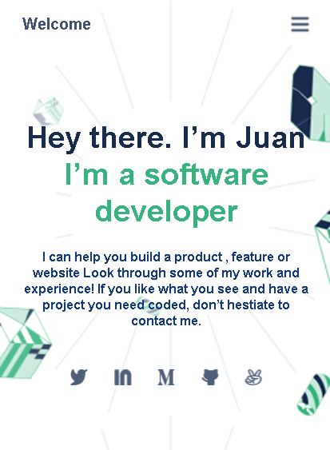

# Portfolio Juan Felipe Gomez Tobon

> Software Developer: Proficient with HTML, CSS, Javascript, Ruby on Rails programming languages.

## Built With

- HTML & CSS

## Live Demo

[Live Demo Link](https://felipeg005.github.io/Portfolio/)

## Getting Started

To get a local copy up and running follow these simple example steps

### Prerequisites

- Browser (Chrome,Firefoxe,IE,Opera,Safari)

### Usage

- Open Html.index file with your browser

👤 **Author**

**Juan Felipe Gomez Tobon**

- GitHub: [@githubhandle](https://github.com/Felipeg005/)
- Twitter: [@twitterhandle](https://twitter.com/JuanFGT05)
- LinkedIn: [LinkedIn](https://www.linkedin.com/in/juan-felipe-gomez-tobon/)

## Show your support

Give a ⭐️ if you like this project!

## Acknowledgments

- Thanks to Microverse for make it possible!

## 📝 License

This project is [MIT](./MIT.md) licensed.
